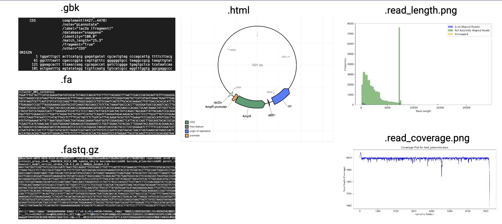

# nf-plasmidsaurus-plasmid
## Introduction
I appreciate Rishud Handa and his team at Plasmidsaurus for looking at my work. I live and breathe Nanopore sequencing and love bioinformatics. Please feel free to ask me any questions about this workflow, my experience, or otherwise through [Linkedin](https://www.linkedin.com/in/ethanmcquhae/) or [email](mailto:ethan.mcq01@gmail.com). Enjoy!

This pipeline employs [Nextflow](https://www.nextflow.io/) and is able to depoly on [Seqera](https://seqera.io/) to create a scalable, elastic, and reproducable production bioinformatics pipeline. 

Refer to the documentation below for all more info and how to use!

As a note, Docker containers used in the modules are made to be used on `linux/arm64 ` devices (Mac Metal). In the interest of time, and to showcase a foundational level of skills, I opted to build it this way. If you wanted to run this on a `linux/amd64` machine, you would simply need to rebuild the containers located in the `assets/docker/*` directory. 

## Table of Contents
- [Execution](#Execution)
- [Outputs](#Outputs)
- [Overview of the Pipeline](#overview-of-the-pipeline)

## Execution
If you already have Docker and Nextflow installed on your Mac system, you can execute the pipeline with a command like this one:
```
nextflow run main.nf --input_dir ~/Desktop/nf-plasmidsaurus-plasmid/assets/test-data-plasmid/ --output_dir ~/Desktop/plasmid_output/ --sample_id sample_id --genome_size 7200 -profile docker
```
Test files are present in the directories already and this should run out of the box. 

These are all required input parameters for the pipeline to run, except for the Docker profile. `--genome_size` would be replaced with your estimated genome size.

Docker and Nextflow installation how-tos can be found in `documentation/`

**CAVEAT:** Again, in the interest of time, I have not built in error catching for `FLYE` or `TRYCYCLER RECONCILE`. If the command exits with the test data, simply rerun the code as it is likely an error from contig creation by Trycycler. Give it 2-3 tries. <3

## Outputs
The output of the pipeline will be a tar.gz file with all of the contents from the pipeline.
```
sample_id/
├── sample_id.fa - Provides consensus sequence of the plasmid.
├── sample_id_pLann.gbk - Provides consensus sequence of the plasmid in gbk format.
├── sample_id_pLann.html - An interactive version of the pLannotate plasmid map.
├── sample_id.merged.fastq.gz - Sequence file of all raw reads.
├── sample_id.read_coverage.png - Consensus sequence plasmid coverage from sequence file.
├── sample_id.read_length.png - Shows read length and counts of unaligned, plasmid aligned, and contaminant aligned reads. 
```

This is an example of a successfully executed pipeline:
```
(base) MacBook-Pro-9:nf-plasmidsaurus-plasmid ethanmcquhae$ nextflow run main.nf --input_dir ~/Desktop/nf-plasmidsaurus-plasmid/assets/test-data-plasmid/ --output_dir ~/Desktop/nf-plasmidsaurus-plasmid/work_output/ --sample_id sample_id --genome_size 7200 -profile docker

 N E X T F L O W   ~  version 24.10.4

Launching `main.nf` [determined_mcclintock] DSL2 - revision: f4d89da379

executor >  local (24)
[00/52258e] process > PLASMID_ASSEMBLY_WORKFLOW:CAT_FASTQ (sample_id)                                 [100%] 1 of 1 ✔
[58/c7b3d7] process > PLASMID_ASSEMBLY_WORKFLOW:ECOLI_FILTER:MINIMAP2_ALIGN (sample_id)               [100%] 1 of 1 ✔
[8d/8dfbf9] process > PLASMID_ASSEMBLY_WORKFLOW:ECOLI_FILTER:SAMTOOLS_VIEW_KEEP_UNALIGNED (sample_id) [100%] 1 of 1 ✔
[6c/892a6f] process > PLASMID_ASSEMBLY_WORKFLOW:ECOLI_FILTER:SAMTOOLS_VIEW_KEEP_ALIGNED (sample_id)   [100%] 1 of 1 ✔
[7c/16fd09] process > PLASMID_ASSEMBLY_WORKFLOW:ECOLI_FILTER:SAMTOOLS_BAM2FQ (sample_id)              [100%] 1 of 1 ✔
[5a/71ef2d] process > PLASMID_ASSEMBLY_WORKFLOW:ECOLI_FILTER:GUNZIP (sample_id_interleaved.fq.gz)     [100%] 1 of 1 ✔
[35/013138] process > PLASMID_ASSEMBLY_WORKFLOW:SEQKIT_SUBSEQ (sample_id)                             [100%] 1 of 1 ✔
[3b/c44162] process > PLASMID_ASSEMBLY_WORKFLOW:RASUSA (sample_id)                                    [100%] 1 of 1 ✔
[5d/7cb6b5] process > PLASMID_ASSEMBLY_WORKFLOW:TRYCYCLER_SUBSAMPLE (sample_id)                       [100%] 1 of 1 ✔
[51/79b552] process > PLASMID_ASSEMBLY_WORKFLOW:FLYE (sample_id_sample_01.fastq)                      [100%] 3 of 3 ✔
[22/d563dd] process > PLASMID_ASSEMBLY_WORKFLOW:TRYCYCLER_COMPLETE:DECONCATENATE (sample_id)          [100%] 1 of 1 ✔
[36/907f7c] process > PLASMID_ASSEMBLY_WORKFLOW:TRYCYCLER_COMPLETE:TRYCYCLER_CLUSTER (sample_id)      [100%] 1 of 1 ✔
[c7/a16d77] process > PLASMID_ASSEMBLY_WORKFLOW:TRYCYCLER_COMPLETE:TRYCYCLER_RECONCILE (sample_id)    [100%] 1 of 1 ✔
[bb/35bd26] process > PLASMID_ASSEMBLY_WORKFLOW:TRYCYCLER_COMPLETE:TRYCYCLER_MSA (sample_id)          [100%] 1 of 1 ✔
[31/0915ab] process > PLASMID_ASSEMBLY_WORKFLOW:TRYCYCLER_COMPLETE:TRYCYCLER_PARTITION (sample_id)    [100%] 1 of 1 ✔
[88/c33aeb] process > PLASMID_ASSEMBLY_WORKFLOW:TRYCYCLER_COMPLETE:TRYCYCLER_CONSENSUS (sample_id)    [100%] 1 of 1 ✔
[31/0896fb] process > PLASMID_ASSEMBLY_WORKFLOW:MEDAKA (sample_id)                                    [100%] 1 of 1 ✔
[76/3b836b] process > PLASMID_ASSEMBLY_WORKFLOW:PLANNOTATE_BATCH (sample_id)                          [100%] 1 of 1 ✔
[95/c3008b] process > PLASMID_ASSEMBLY_WORKFLOW:MINIMAP2_ALIGN (sample_id)                            [100%] 1 of 1 ✔
[17/31c773] process > PLASMID_ASSEMBLY_WORKFLOW:PLOT_HISTOGRAM (sample_id)                            [100%] 1 of 1 ✔
[21/5e7118] process > PLASMID_ASSEMBLY_WORKFLOW:PLOT_COVERAGE (sample_id)                             [100%] 1 of 1 ✔
[8c/88516a] process > PLASMID_ASSEMBLY_WORKFLOW:ZIP (sample_id)                                       [100%] 1 of 1 ✔
Completed at: 26-Feb-2025 13:26:19
Duration    : 1m 36s
CPU hours   : (a few seconds)
Succeeded   : 24
```
## Overview of the Pipeline
The folder structure is intentional:

```
nf-plasmidsaurus-plasmid/
├── assets/
│   └── Directory for other project files
├── modules/
│   └── Directory for Nextflow DSL2 modules
├── workflows/
│   └── Directory for Nextflow DSL2 subworkflows 
├── main.nf - The main Nextflow script file
├── nextflow.config - The main configuration file
├── modules.json - allows nf-core to keep track of nf-core installed dependencies
└── README.md
```
### main.nf
The entire pipeline is [DSL2](https://seqera.io/blog/dsl2-is-here/) optimized:
```
nextflow.enable.dsl = 2
```

`main.nf` is made to handle an incoming execution request like this one:
```
nextflow run main.nf --input_dir ~/Desktop/nf-plasmidsaurus-plasmid/assets/test-data-plasmid/ --output_dir ~/Desktop/nf-plasmidsaurus-plasmid/work_output/ --sample_id test_plasmids --genome_size 7200
```

### nextflow.config
When a pipeline script is launched, Nextflow looks for configuration files in multiple locations. Since each configuration file may contain conflicting settings, they are applied in the following order (from lowest to highest priority):

    1. Parameters defined in pipeline scripts (e.g. main.nf)

    2. The config file $HOME/.nextflow/config, or $NXF_HOME/.nextflow/config when NXF_HOME is set (see NXF prefixed variables).

    3. The config file nextflow.config in the project directory

    4. The config file nextflow.config in the launch directory

    5. Config file specified using the -c <config-file> option

    6. Parameters specified in a params file (-params-file option)

    7. Parameters specified on the command line (--something value)

The base `nextflow.config` file is for declaring global variables that will be used in all workflows, subworkflows, and modules. 

### bin/ conf/ assets/    
Please refer to directory descriptions and files located in those directories for what belongs there. 

The `deconcat.py` script was taken and edited by myself to be more streamlined from the `wf-clonal-variation` Epi2Me pipeline. 

### assets/
`assets/` stores any reference [Dockerfiles](https://docs.docker.com/reference/dockerfile/), test files, reference genomes, and other files necessary for workflow execution.

Additionally, all test data used to produce this pipeline was accessed from the [Nanopore London Calling 2024 datasets repository](https://labs.epi2me.io/lc2024-datasets/) and downloaded from `s3://ont-open-data/londoncalling2024/rbk-plasmid/inputs/`

### modules/ 
Modules are reusable, standardized building blocks for Nextflow pipelines. They are designed to simplify workflow development by providing pre-built, community-maintained processes for common bioinformatics tasks.

I have also developed my own modules to port into pipelines that follow standard nf-core style and formatting.

Key Features of [nf-core Modules](https://nf-co.re/modules/)

    Reusability – Modules can be used across multiple nf-core pipelines.
    Standardization – They follow best practices and nf-core guidelines.
    Version Control – Managed via GitHub, ensuring updates and improvements.
    Container Support – Comes with predefined Docker, Singularity, and Conda environments.
    Customization – Parameters can be modified to fit different workflows.

### workflows/ and subworkflows/ 
`workflows/` and `subworkflows/` hosts workflows and subworkflows respectively, which are reusable, modular components that groups multiple processes (`modules/`) together within a pipeline. It helps in organizing complex workflows by encapsulating a sequence of steps into a single unit, making the pipeline more manageable, reusable, and scalable.

Key Characteristics of a Subworkflow:

    Encapsulation – Combines multiple processes into a single logical unit.
    Reusability – Can be used across multiple Nextflow pipelines.
    Modularity – Helps keep workflows clean and structured.
    Improved Maintainability – Changes to a subworkflow update all pipelines that use it.

**MAIN POINT:** Do not perform analysis within the main workflow scripts. If analysis or calling of outside package or scripts is necessary and there is not already a pre-built module, make one. 

---
